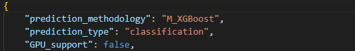
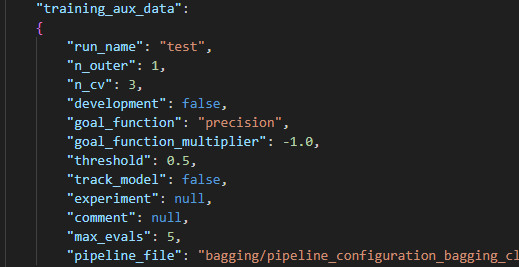
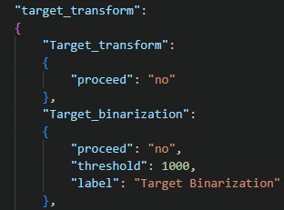
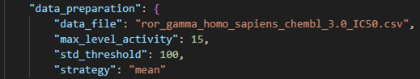
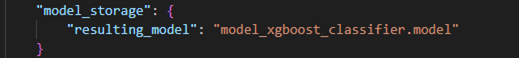

QSPRmodeler - open source application for molecular predictive analytics
==============================

# The introduction
Quantitative Structure-Property Relationship (QSPR) is a computational method that lets users reveal relationships between a structure representation and the target molecular feature.
The structure can be represented via molecular descriptors or /and via molecular fingerprints, and the connections between this structural information and the desired target feature are examined.
Within the scope of possible machine learning methodologies, we can employ: XGBoost, multilayer perceptron (MLP), Random Forest, Bagging, Support Vector Machines (SVM) or Ridge. They can be used to construct regression or classification models.
The aim of the library provided is to process the data and optimize the machine learning model’s hyperparameters to reveal the best possibility out of them. Target feature can be processed according to the issue that we are trying to solve. For the classification issue, binarization needs to be done. The user can define the threshold for the target feature. For the regression problems, logarithmic scaling is performed. Principal Component Analysis (PCA) can be utilized if molecular fingerprints are used as structural features. It is highly important in the case of MLP.
The next thing is to pick a methodology that we want to examine and run the training procedure. As a result, the best possible model (with the best hyperparameters) will be saved. By the best, we believe that it is the one with the best training and testing agreement between real values and predicted values.
The library can be useful for the examination of various machine learning methodologies for QSPR or QSAR studies. The whole library takes advantage of open-source chemoinformatic libraries such as RDKit or Mordred; thus, it is written in Python.


# How to use the software
1. Place your dataset with the SMILES column and the target feature inside the ```data``` folder.

2. Define the methodology and the problem type; modify one of the files present in the ```training_configurations``` folder.



3. Copy and paste the path to the pipeline file (which is present in the ```pipelines``` folder), depending on what features have to be used (inside this file, the threshold for the classification can be defined).




4. Define the file’s name with your datapoints.
4.1. If more than one entry is present for one datapoint, the standard deviation can be used to remove these observations (the threshold can be defined).
4.2. Two strategies for data aggregation can be used: median or mean.



5. Define your model’s name (it will be saved in ```models``` folder).



6. Now run the command (inside the ```src``` folder) ```python activity_prediction_model_creation.py --training_conf <training configuration file.json>```, optionally, ```nohup``` can be added before ```python```. The training will start, and all the parameters that were previously set will be applied during the code execution.

7. The best model can be loaded, and predictions can be made.

# How to analyze the result
To show how the trained model can be used in the inference mode we delver a set of Jupyter notebooks (directory: ```notebooks```).